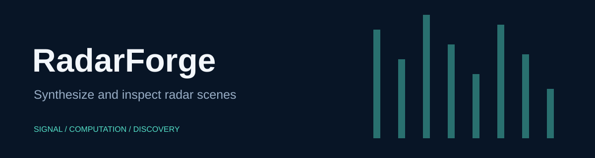

# RadarForge

A 3D millimeter-wave radar dataset and MATLAB signal synthesizer, including camera imagery, depth maps, CAD assets, and radar heatmaps.

> **Development history:** Developed locally before publication. These repositories were uploaded together, so their GitHub publication dates do not indicate when development began.

## Quick start

Open MATLAB in this repository, then use the branded entry point:

```matlab
heatmap = radar_forge(signal_array);
```

The entry point preserves the existing function's arguments, errors, and numerical output. Existing script and function names remain available for compatibility. No sensor starts when you open this repository.

## Inputs and workflows

The signal tensor uses 400 fast-time samples and a 40 × 40 receiver array under the bundled configuration. Dataset/documentation and Synthesizer/documentation describe the retained assets. Synthesizer/scripts/main.m orchestrates synthesis. Point-reflector sampling uses datasample (Statistics and Machine Learning Toolbox). The repository does not include a trained neural reconstruction model or the advertised cGAN training implementation.

## Verification

Run `run('tests/smoke_test.m')` from the repository root. See [verification details](docs/VERIFICATION.md) for the tested scope and unavailable checks. Computational source and bundled scientific assets are retained byte-for-byte; the added facade and documentation provide the new presentation.

## License

Synthesizer/COPYRIGHT.txt retains the separate university notice. MIT in LICENSE-branding covers only new documentation, artwork, wrapper, and checks. Existing dataset and asset notices remain in place.
